# NSSC1 Numerical Methods for Ordinary Differential Equations Exercises

For this exercise, we compared several different time-stepping methods for a mass attached to a spring, this is described by the ODE:

$$m y''(t) = -k y(t)$$

giving us a simple harmonic oscilator system, with $k$ as the spring constant, $m$ as the mass, and $y(t)$ as displacement.
This second-order equation can be replaced with the first order system:

$$
y_{0}^{\prime} = y_{1} \\
y_{1}^{\prime} = - \frac{k}{m} y_{0}
$$

```cpp
class MassSpring : public NonlinearFunction
{
  double m_mass;
  double m_stiffness;
  
public:
  MassSpring (double m, double k)
    : m_mass(m), m_stiffness(k) {}
  
  size_t dimX() const override { return 2; }
  size_t dimF() const override { return 2; }
  
  void evaluate (VectorView<double> x, VectorView<double> f) const override
  {
    f(0) = x(1);
    f(1) = -m_stiffness/m_mass * x(0);
  }
  
  void evaluateDeriv (VectorView<double> x, MatrixView<double> df) const override
  {
    df = 0.0;
    df(0,1) = 1;
    df(1,0) = -m_stiffness/m_mass;
  }
};

```

Once this system has been set up they can be solved using various timestep methods.

These methods are implemented by modifying the base class `TimeStepper`.

```cpp

class TimeStepper
{
  protected:
    std::shared_ptr<NonlinearFunction> m_rhs;
  public:
    TimeStepper(std::shared_ptr<NonlinearFunction> rhs) : m_rhs(rhs) {}
    virtual ~TimeStepper() = default;
    virtual void doStep(double tau, VectorView<double> y) = 0;
};
```

# Explicit Euler Method
The first time step method is the Explicit Euler Method. It is an explicit, one-step method where the ODE

$$
y^{\prime}(t) = f(y(t)) \quad \forall t \in [0,T], \quad y(0) = y_{0}
$$

is solved by using this method:

$$
y_{i+1} = y_{i} + \tau f(y_{i}) \quad \text{for } 0 \leq i < n
$$

with $\tau = T/n$. The error of this method is proptional to the step size, making it have first order accuracy $O(\tau)$. The method is only conditionally stable, and when utilized for a pure harmonic oscilator, as it was in this case, it is not stable as energy is added to the system causing the amplitude of the oscillations to increase.

The class `ExplicitEuler` looks like this:

```cpp

class ExplicitEuler : public TimeStepper
{
  Vector<> m_vecf;
public:
  ExplicitEuler(std::shared_ptr<NonlinearFunction> rhs)
  : TimeStepper(rhs), m_vecf(rhs->dimF()) {}
  
  void doStep(double tau, VectorView<double> y) override
  {
    this->m_rhs->evaluate(y, m_vecf);
    y += tau * m_vecf;
  }
};
```

Here the base class is updated by modifying the `doStep` function. It now takes `tau` and `m_vectf` as inputs and then updates the state vector by adding them.

# Implicit Euler Method
Next up, we had to try out the Implicit Euler Method. Compared to the explicit Euler method, the implicit Euler Method is more computationally expensive, due to it having to solve a potentially nonlinear equation for $y_i+1$. This is done using a built in Newton Solver. The method is also first-order accurate, with the error decreasing linearly with step size $\tau$. However, this method is both A-stable and L-stable. It has a dampening effect built in which causes the oscillations to decay over time, despite not having any friction defined in the system.


The Method is defined by

$$
\frac{y_{i+1} - y_i}{t_{i+1} - t_i} = f(t_{i+1}, y_{i+1})
$$

or it can be rewritten as

$$
y_{i+1} = y_i + \tau\, f(t_{i+1}, y_{i+1}), \qquad 0 \le i < n
$$

The code was already provided. The implementation utilized was

$$
y - y_{old} - τf(y) = 0
$$

with the provided class

```cpp
class ImplicitEuler : public TimeStepper
  {
    std::shared_ptr<NonlinearFunction> m_equ;
    std::shared_ptr<Parameter> m_tau;
    std::shared_ptr<ConstantFunction> m_yold;
  public:
    ImplicitEuler(std::shared_ptr<NonlinearFunction> rhs)
    : TimeStepper(rhs), m_tau(std::make_shared<Parameter>(0.0))
    {
      m_yold = std::make_shared<ConstantFunction>(rhs->dimX());
      auto ynew = std::make_shared<IdentityFunction>(rhs->dimX());
      m_equ = ynew - m_yold - m_tau * m_rhs;
    }

    void DoStep(double tau, VectorView<double> y) override
    {
      m_yold->set(y);
      m_tau->set(tau);
      NewtonSolver(m_equ, y);
    }
  };
```
# Improved Euler Method

This method involved modifying the `ExplicitEuler` time-stepping method by replacing the time steps with

$$
\tilde{y} = y _n + \frac{τ}{2}f(y_n) \\
y_{n+1} = y_{n} + τf(\tilde{y})
$$

This method is also explicit, however it is second-order $O(τ^{2}))$ accurate, causing the error to decrease in proportion to the square of the timestep. It is still not stable, and also does not need a `NewtonSolver` as it only requires two function evaluations.

```cpp
class ImprovedEuler : public TimeStepper{
    Vector<> m_vecf;
    Vector<> halfway;
  public:
    ImprovedEuler(std::shared_ptr<NonlinearFunction> rhs)
    : TimeStepper(rhs), m_vecf(rhs->dimF()), halfway(rhs->dimX()) {}
    void DoStep(double tau, VectorView<double> y) override
    {
      this->m_rhs->evaluate(y, m_vecf);
      halfway = y;
      halfway += (0.5*tau)*m_vecf;

      m_rhs->evaluate(halfway, m_vecf);
      y += tau * m_vecf;
    }
  };
```

# Crank-Nicolson Method

The `CrankNicolson` class was implemented by modifying the `ImplicitEuler` class. They both rely on the `NewtonStepper` as they are implicit methods, the difference however, is in the way the steps are calculated

$$
y_{i+1} = y_i + \frac{τ}{2}(f(t_i, y_i) + f(t_{i+1}, y_{i+1}) \qquad 0 \le i < n
$$

This method is a one-step method. It utilizes the trapezoidal integration rule for the formulation of the steps and has second-order accuracy. It is A-stable, and unlike the implicit Euler Method it is energy conserving, meaning that the oscillations will continue without decay or explostion (Explicit Euler).

```cpp
class CrankNicolson : public TimeStepper
  {
    std::shared_ptr<NonlinearFunction> m_equ;
    std::shared_ptr<Parameter> m_tau;
    std::shared_ptr<ConstantFunction> m_yold;
    std::shared_ptr<ConstantFunction> m_f_old;

  public:
    CrankNicolson(std::shared_ptr<NonlinearFunction> rhs)
    : TimeStepper(rhs), m_tau(std::make_shared<Parameter>(0.0))
    {
      m_yold = std::make_shared<ConstantFunction>(rhs->dimX());
      auto ynew = std::make_shared<IdentityFunction>(rhs->dimX());
      m_fold = std::make_shared<ConstantFunction>(rhs->dimX());
      m_equ = ynew - m_yold - 0.5 * (m_tau * (m_rhs + m_fold));
    }

    void DoStep(double tau, VectorView<double> y) override
    {
      Vector<double> fy_val(y.size());
      m_rhs->evaluate(y, fy_val);
      
      m_fold->set(fy_val);
      m_yold->set(y);       
      m_tau->set(tau);      

      NewtonSolver(m_equ, y);
    }
  };
```


### Interpretation of Plots

10 Steps

 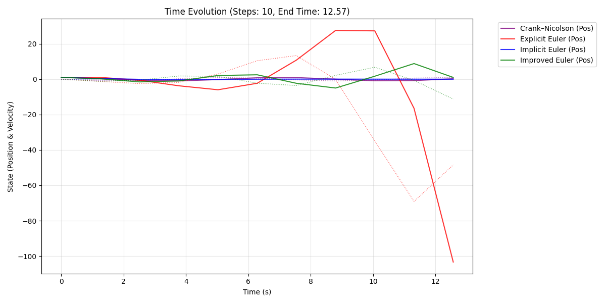

Phase portrait and time evolution for 10 steps, end time 12.57.

 

Phase portrait and time evolution for 10 steps, end time 62.83.

 

Phase portrait and time evolution for 10 steps, end time 314.16.

1. **Large step sizes (τ = 10)**  
   For large time steps, the numerical method introduces significant deformation in the phase plot.  
   The the phase plots become heavily distorted, showing numerical damping or energy increase.
   It is a direct consequence of the low resolution of the discretization and instability of the method.

100 Steps

 

Phase portrait and time evolution for 100 steps, end time 12.57.

 

Phase portrait and time evolution for 100 steps, end time 62.83.

 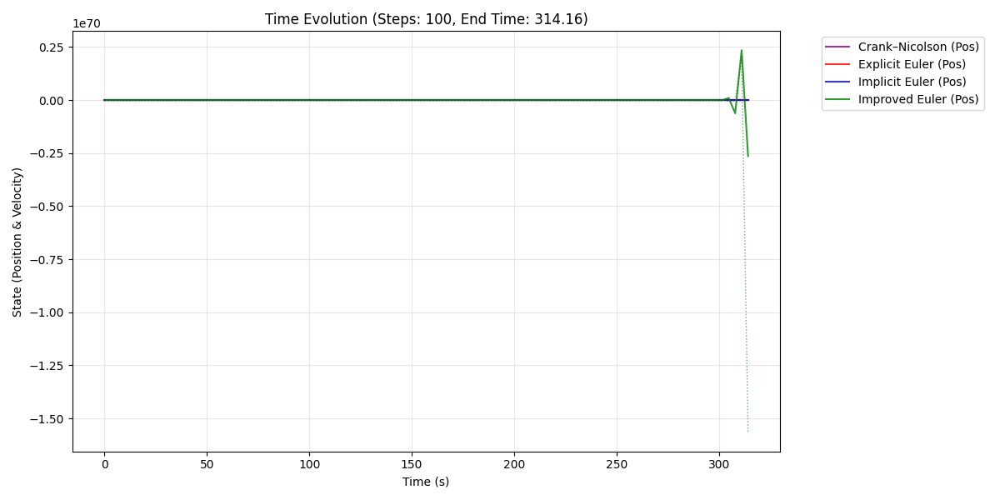

Phase portrait and time evolution for 100 steps, end time 314.16.

1000 Steps

 

Phase portrait and time evolution for 1000 steps, end time 12.57.

 

Phase portrait and time evolution for 1000 steps, end time 62.83.

 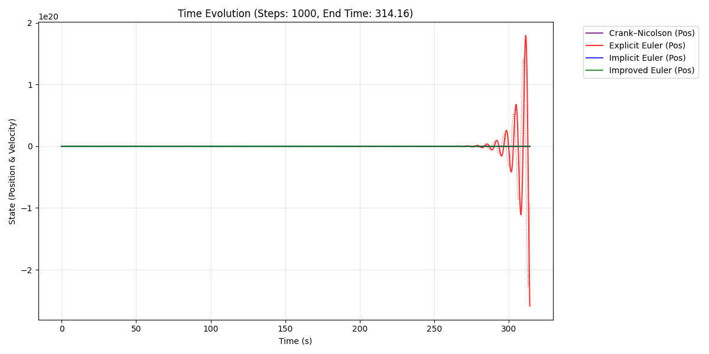

Phase portrait and time evolution for 1000 steps, end time 314.16.

2. **Medium step sizes (τ = 100, 1000)**  
   As the time step decreases, the phase portraits become smoother and more symmetric. In the plots we can nicely see, that the explicit Euler Method increases in amplitude, while the implicit Euler Method decreases over time. This is especially noticable in the plots where the End Time is set to 314.16 seconds.

10000 steps

 

Phase portrait and time evolution for 10000 steps, end time 12.57.

 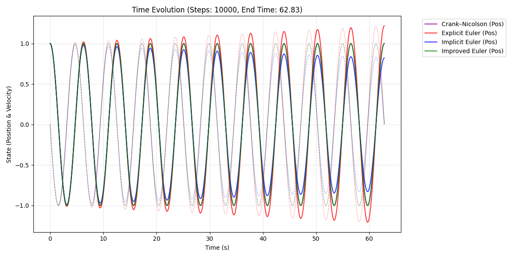

Phase portrait and time evolution for 10000 steps, end time 62.83.

 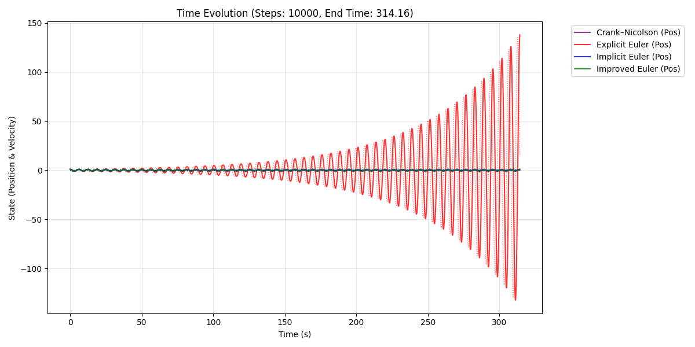

Phase portrait and time evolution for 10000 steps, end time 314.16.

100000 steps

 

Phase portrait and time evolution for 100000 steps, end time 12.57.

 

Phase portrait and time evolution for 100000 steps, end time 62.83.

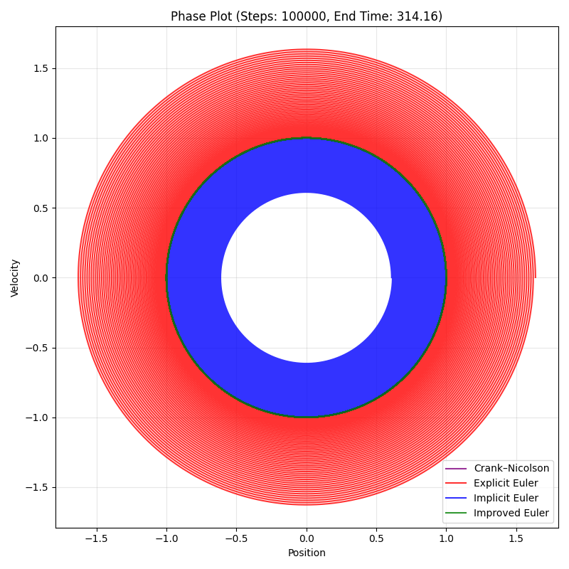 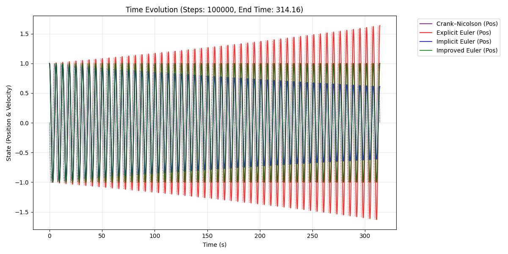

Phase portrait and time evolution for 100000 steps, end time 314.16.

3. **Very small step sizes (τ = 10000, 100000)**  
   For the smallest step size considered, the phase curves converge toward the analytical solution.  
   The trajectories become closed and circular, indicating stable long term behavior and good energy conservation. Altough on both plots with End Time = 314.16s, the explicit Euler Method again increases in Amplitude, showing that even at extremely small step sizes the method is not energy-preserving and accumulates a systematic energy error over long integration times.

   ### Overall Conclusions

As we can see in the plots, for very large τ, the waveform becomes visibly jagged. Even if we increase the number of steps, some time evolution plots show growing amplitude, others show damped amplitude, depending on the Numeric Method used. For example the explicit Euler method injects energy, therefore resulting in a growing amplitude. In contrast,the implicit Euler Method is both A-stable and L-stable. It has built in dampening, which dissipates energy and causes dampening over time.
The Crank-Nicholson Method is energy preserving, therefore the oscillations will continue without dampening or amplification. 


For τ = 100000, the numerical time evolution is smooth and closely matches the expected sinusoidal behavior.  This demonstrates the expected convergence behavior of the integrators: as τ decreases, the numerical error shrinks at the rate predicted by the theoretical order of the method.


# NSSC1 Numerical Methods for Ordinary Differential Equations Exercises Part 2
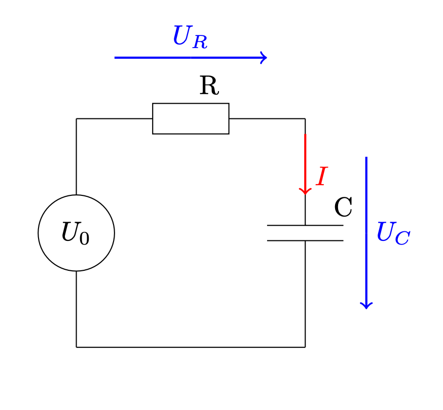

## Exercise Report: Electric Network Simulation

### 1. Mathematical Model

We model a simple RC circuit consisting of a resistor $R$, a capacitor $C$, and a time-dependent voltage source $U_0(t) = \cos(100 \pi t)$.

Using Ohm's law ($U_R = R I$) and the capacitor equation ($I = C \dot{U}_C$), we apply Kirchhoff's voltage law, which states that voltages around a loop sum to zero ($U_0 = U_R + U_C$). This yields the linear Ordinary Differential Equation (ODE):

$$U_C(t) + RC \frac{dU_C}{dt}(t) = U_0(t)$$

Rearranging for the derivative, we obtain the standard non-autonomous form $\dot{y} = f(t, y)$:

$$\frac{dU_C}{dt} = \frac{U_0(t) - U_C(t)}{RC} = \frac{\cos(100 \pi t) - U_C}{RC}$$

### 2. Transformation to Autonomous Form

To utilize numerical solvers designed for autonomous systems ($\dot{\mathbf{y}} = F(\mathbf{y})$), we must eliminate the explicit time dependence. We achieve this by extending the state space to treat time as a dependent variable.

We define a new state vector $\mathbf{y} \in \mathbb{R}^2$:

* $y_1 = U_C$ (Capacitor Voltage)
* $y_2 = t$ (Time)

The derivatives are formulated as follows:

* **Voltage:** $\dot{y}_1 = \frac{U_0(y_2) - y_1}{RC}$
* **Time:** $\dot{y}_2 = \frac{dt}{dt} = 1$

This results in the following autonomous system:

$$\dot{\mathbf{y}} = \begin{pmatrix} \frac{\cos(100 \pi y_2) - y_1}{RC} \\ 1 \end{pmatrix}$$

### 3. Jacobian for Implicit Methods

For the implementation of implicit solvers (Implicit Euler, Crank-Nicolson), the Jacobian matrix $J = \frac{\partial F}{\partial \mathbf{y}}$ is required. Differentiating the system vector with respect to $y_1$ and $y_2$:

$$J = \begin{pmatrix} 
\frac{\partial \dot{y}_1}{\partial y_1} & \frac{\partial \dot{y}_1}{\partial y_2} \\
\frac{\partial \dot{y}_2}{\partial y_1} & \frac{\partial \dot{y}_2}{\partial y_2}
\end{pmatrix} = 
\begin{pmatrix} 
-\frac{1}{RC} & -\frac{100 \pi \sin(100 \pi y_2)}{RC} \\
0 & 0
\end{pmatrix}$$

The simulation uses this system with initial conditions $\mathbf{y}(0) = [0, 0]^T$.

### 4. Setup

When running the code 3 different stepping sizes have been used. $N = \{100, 1000, 10000\}$. And the two different model parameters $R=1, C=1$ and $R=100, C=10^{-6}$. As a total time 0.1 seconds were choosen. The results displayed in graphs can be found below. For each step size the resulting Capacity Voltage has been plotted for the 3 numerical methods: The explicit Euler, the implicit Euler and the Crank-Nicolson. The input voltage has been scaled to the the size of the capacity voltage, so that the phase shift can be nicely seen.

**Simulation Results**

 

*Plot for 100 time steps and $R=1, C=1$*

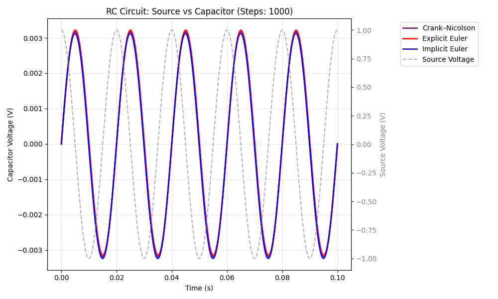

*Plot for 1000 time steps and $R=1, C=1$*

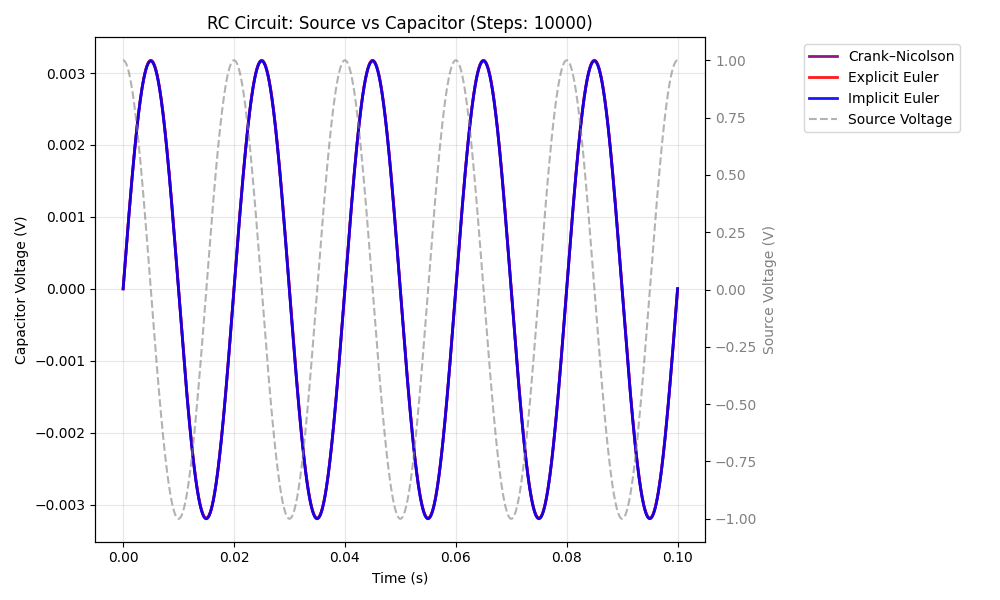

*Plot for 10000 time steps and $R=1, C=1$*

 

*Plot for 100 time steps and $R=100, C=10^{-6}$*


*Plot for 1000 time steps and $R=100, C=10^{-6}$*


*Plot for 10000 time steps and $R=100, C=10^{-6}$*

---

## Analysis of Simulation Results

### Part 1: ($R=100, C=10^{-6}$)

**1. Stiffness & Stability Limits**

The system is stiff, characterized by a fast time constant $\tau = RC = 10^{-4}s$ and a large negative eigenvalue $\lambda = -10000$.

* **Explicit Euler Stability Condition:** $|1 + \lambda \Delta t| \le 1$.
    For this system, stability requires $\Delta t \le 2 \cdot 10^{-4}s$.
* **Implicit Method Stability:** Implicit Euler and Crank-Nicolson are A-stable, meaning they remain stable for any step size $\Delta t$, regardless of $\tau$.

**2. Method Behavior**

* **Explicit Euler**
    * **100 Steps ($\Delta t = 10\tau$):** Violates the stability condition ($10\tau > 2\tau$). The solution explodes immediately, reaching physically impossible values ($10^{57}$).
    * **1000 Steps ($\Delta t = \tau$):** Stable. Because $\Delta t = \tau$, the derivative projection lands exactly on the steady-state value in a single step (jumping from 0 to 1 instantly).

* **Implicit Euler**
    * **Stable but Damped:** Even with large steps ($10\tau$), the solution never explodes. However, it exhibits numerical damping, causing the voltage to lag behind the rapid initial changes.

* **Crank-Nicolson**
    * **Stable but Oscillatory:** Also stable for large steps ($10\tau$). However, it suffers from spurious oscillations (overshoot $>1$) during the initial transient because it averages the derivatives at $t_n$ and $t_{n+1}$, struggling to resolve the fast charge-up.

### Part 2: System ($R=1, C=1$)

**1. System Characteristics**

With the new parameters, the system dynamics change drastically:

* Time Constant: $\tau = RC = 1 \, s$.
* Eigenvalue: $\lambda = -1$.
* Stability Limit (Explicit): $|1 - \Delta t| \le 1 \Rightarrow \Delta t \le 2 \, s$.

This system is non-stiff because the time constant ($\tau=1$) is much slower than the simulation time steps used ($10^{-3}$ to $10^{-5}$).

**2. Stability Analysis**

Unlike the previous case, all methods are stable for all step sizes tested.
The largest step size used is $\Delta t = 0.001 \, s$.
Since $0.001 \ll 2$ (the stability limit), Explicit Euler is well within its stability region.
*Observation:* No explosions or wild oscillations are observed.

**3. Physical Behavior: Low-Pass Filtering & Phase Shift**

The circuit acts as a strong low-pass filter with significant phase lag.

* **Amplitude Attenuation:**
    Since the source frequency $\omega = 100\pi \approx 314$ rad/s is much higher than the cutoff $\omega_c = 1$ rad/s, the amplitude is attenuated by a factor of $\approx 1/314$. The data shows peaks around $0.003$V, matching this theory.

* **Phase Shift ($\phi$):**
    The theoretical phase shift is $\phi = -\arctan(\omega RC) = -\arctan(314) \approx -89.8^\circ$.

* **Observation in Data:**
    The voltage should lag the source by almost exactly $90^\circ$ ($\pi/2$), which corresponds to a time lag of $0.005s$ (quarter period). Looking at the graphs the capacitor voltage behaves like a Sine wave while the source is a Cosine wave, demonstrating the predicted $90^\circ$ lag.

### Comparison of Methods

Because the step sizes are small relative to the system time constant ($\Delta t \ll \tau$), the numerical errors are small for all methods.

* **Amplitude Discrepancy (Low N):** At the coarsest resolution (100 steps), there is a distinct difference in amplitude due to numerical error properties.
    * Explicit Euler overestimates the peak ($\approx 0.0036$V).
    * Crank-Nicolson sits in the middle ($\approx 0.0031$V).
    * Implicit Euler is the most damped and underestimates the peak ($\approx 0.0026$V).
    * *Reason:* This occurs because Explicit Euler extrapolates linearly (overshooting convex curves), while Implicit Euler is numerically dissipative.

* **Resolution:** Even the coarsest resolution (100 steps, $\Delta t = 0.001$) provides $\sim 20$ points per period of the source ($T=0.02s$), sufficient to capture the general wave shape, though the amplitude accuracy varies by method as noted above.

### Summary Comparison

| Parameter Set | Time Constant $\tau$ | System Type | Explicit Euler (100 steps) | Physical Outcome |
| :--- | :--- | :--- | :--- | :--- |
| **Set 1 ($R=100, C=10^{-6}$)** | $10^{-4} s$ | Stiff | Unstable (Explodes) | Fast charge (tracks source) |
| **Set 2 ($R=1, C=1$)** | $1 s$ | Non-Stiff | Stable | Filtered (Low amp, $90^\circ$ lag) |

## Code

```cpp
class ElectricNetwork : public NonlinearFunction
{
private:
  double R;
  double C; 

public:
  ElectricNetwork(double r, double c) : R(r), C(c) {}

  size_t dimX() const override { return 2; }
  size_t dimF() const override { return 2; }

  void evaluate (VectorView<double> x, VectorView<double> f) const override
  {
    double Uc = x(0);
    double t  = x(1);
    f(0) = (std::cos(100.0 * M_PI * t) - Uc) / (R * C);
    f(1) = 1.0;
  }

  void evaluateDeriv (VectorView<double> x, MatrixView<double> df) const override
  {
    double t = x(1);
    df = 0.0;
    df(0,0) = -1.0 / (R * C);
    df(0,1) = -(100.0 * M_PI) * std::sin(100.0 * M_PI * t) / (R * C);
    df(1,0) = 0.0;
    df(1,1) = 0.0;
  }
};
```

# Exercise 18.4

We can use automatic differentiation to compute the derivative of a function.  
In the first part of this exercise, we had to implement additional operators and functions for the `AutoDiff` class.

---

## Subtraction

```cpp
template <size_t N, typename T = double>
AutoDiff<N, T> operator- (const AutoDiff<N, T>& a, const AutoDiff<N, T>& b)
{
    AutoDiff<N, T> result(a.value() - b.value());
    for (size_t i = 0; i < N; i++)
        result.deriv()[i] = a.deriv()[i] - b.deriv()[i];
    return result;
}
```

The subtraction operator implements element-wise differentiation of the expression  
$ a - b $. Because subtraction is linear, the derivative of the result is simply the difference of the individual derivatives, making this operator straightforward to implement.

---

## Division

```cpp
template <size_t N, typename T = double>
AutoDiff<N, T> operator/ (const AutoDiff<N, T>& a, const AutoDiff<N, T>& b)
{
    AutoDiff<N, T> result(a.value() / b.value());
    for (size_t i = 0; i < N; i++)
        result.deriv()[i] =
            (a.deriv()[i] * b.value() - a.value() * b.deriv()[i]) /
            (b.value() * b.value());
    return result;
}
```

The division operator computes both the value and derivative of the quotient $\frac{a}{b}\$ using the quotient rule:

$$ \frac{d}{dx_i}\!\left(\frac{a}{b}\right) = \frac{a_i' \, b - a\, b_i'}{b^2} $$

This allows automatic differentiation to propagate derivatives correctly through division.

These operators enable the evaluation and plotting of derivatives of the Legendre polynomials later in the exercise.

---

# Additional AutoDiff Functions

Below are the functions added to extend the mathematical capabilities of the `AutoDiff` class.

---

## Square

```cpp
template <size_t N, typename T = double>
AutoDiff<N, T> square(const AutoDiff<N, T>& a)
{
    AutoDiff<N, T> result(a.value() * a.value());
    for (size_t i = 0; i < N; i++)
        result.deriv()[i] = T(2) * a.value() * a.deriv()[i];
    return result;
}
```

This function computes $ a^2 $ and uses the derivative  
$ \frac{d}{dx}(a^2) = 2a\,a' $.  
It demonstrates how simple nonlinear operations can be expressed through the product rule.

---

## Square Root

```cpp
template <size_t N, typename T = double>
AutoDiff<N, T> sqrt(const AutoDiff<N, T>& a)
{
    T val = std::sqrt(a.value());
    AutoDiff<N, T> result(val);

    for (size_t i = 0; i < N; i++)
        result.deriv()[i] = a.deriv()[i] / (T(2) * val);

    return result;
}
```

The square root uses the derivative identity  
$ \frac{d}{dx}\sqrt{a} = \frac{a'}{2\sqrt{a}} $


---

## Cosine

```cpp
template <size_t N, typename T = double>
AutoDiff<N, T> cos(const AutoDiff<N, T> &a)
{
    AutoDiff<N, T> result(cos(a.value()));
    for (size_t i = 0; i < N; i++)
        result.deriv()[i] = -sin(a.value()) * a.deriv()[i];
    return result;
}
```

---

## Tangent

```cpp
template <size_t N, typename T = double>
AutoDiff<N, T> tan(const AutoDiff<N, T> &a)
{
    AutoDiff<N, T> result(tan(a.value()));
    T sec2 = 1 / (cos(a.value()) * cos(a.value()));
    for (size_t i = 0; i < N; i++)
        result.deriv()[i] = sec2 * a.deriv()[i];
    return result;
}
```
Both the tan function and the cosine function were implemented practically identical to the sine function.

---

## Logarithm

```cpp
template <size_t N, typename T = double>
AutoDiff<N, T> log(const AutoDiff<N, T> &a)
{
    AutoDiff<N, T> result(log(a.value()));
    for (size_t i = 0; i < N; i++)
        result.deriv()[i] = a.deriv()[i] / a.value();
    return result;
}
```

The natural logarithm uses  
$ \frac{d}{dx}\log(a) = \frac{a'}{a} $

---

## Exponential

```cpp
template <size_t N, typename T = double>
AutoDiff<N, T> exp(const AutoDiff<N, T> &a)
{
    AutoDiff<N, T> result(exp(a.value()));
    for (size_t i = 0; i < N; i++)
        result.deriv()[i] = result.value() * a.deriv()[i];
    return result;
}
```

The exponential function follows  
$
\frac{d}{dx} e^{a} = e^{a}\, a'
$.  

---

# Legendre Polynomials

To evaluate Legendre polynomials and their derivatives up to order 5, we implemented a templated function `LegendrePolynomials` based on the standard recurrence relation

$$
P_0(x) = 1, \qquad P_1(x) = x
$$

$$
P_k(x) =
\frac{(2k-1)\,x\,P_{k-1}(x) - (k-1)\,P_{k-2}(x)}{k}
$$

We can see here how the implementation of additional of operators was required for the `AutoDiff` method to work, since the division and the subtraction operator are essential parts of the legendre polynomial.

```cpp 
#include <iostream>
#include <fstream>
#include <vector>
#include "autodiff.hpp"
#include "legendre.hpp"

using ASC_ode::AutoDiff;

int main() {
    const int N = 5;

    std::ofstream file("../results/legendre_output.csv");
    file << "x";
    for (int i = 0; i <= N; i++) file << ",P" << i << ",dP" << i;
    file << "\n";

    for (double t = -1.0; t <= 1.0; t += 0.01) {

        AutoDiff<1,double> x(t);
        x.deriv()[0] = 1.0;

        std::vector<AutoDiff<1,double>> P;
        LegendrePolynomials(N, x, P);

        file << t;
        for (int i = 0; i <= N; i++)
            file << "," << P[i].value() << "," << P[i].deriv()[0];
        file << "\n";
    }

    std::cout << "Wrote legendre_output.csv (polynomials + derivatives)\n";
    return 0;
}
```
In the main program, each sample point $ x \in [-1,1] $ is represented as an `AutoDiff` variable with its derivative initialized to one. Passing this variable into the Legendre routine ensures that both $ P_k(x) $ and $ \frac{dP_k}{dx} $ are computed automatically through the recurrence. The LegendrePolynomials function then computes both the polynomial values and their exact derivatives at that point.

---

# Results


The first plot shows the Legendre polynomials $P_0$ through $P_5$. The higher order Polynomials exhibit increasing oscillatory behavior. They also all satisfy the boundary condition $P_n(1) = 1$. The overall symmetry properties are clearly visible: even polynomials are symmetric, whereas odd polynomials are asymmetric.

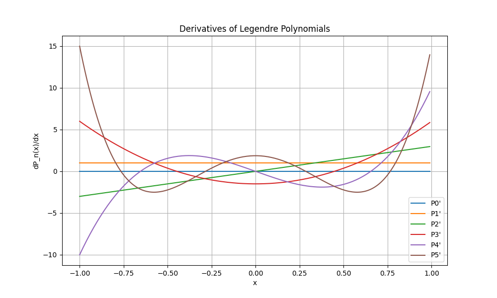

The second plot shows the corresponding derivatives. Since differentiation lowers the polynomial degree by one, the derivative curves display fewer zero crossings and opposite parity: the derivative of an even Legendre polynomial is odd and vice versa.

Together, the two plots illustrate the structure of Legendre polynomials and demonstrate the effectiveness of automatic differentiation in propagating exact derivatives through a recursive definition.

## Testing of the AutoDiff Class for the Pendulum

### 1. Mathematical Model
The motion of a simple pendulum is described by the nonlinear second-order differential equation

$$
\ddot{\alpha}(t) + \frac{g}{L}\sin(\alpha(t)) = 0,
$$

where $\alpha(t)$ is the angular displacement, $L$ the length of the pendulum, and $g$ the gravitational acceleration.

### 2. Transformation to Autonomous Form
To apply standard ODE solvers, the equation is rewritten as a first-order system. Introducing the angular velocity

$$
\beta = \dot{\alpha},
$$

we obtain the autonomous system

$$
\dot{\alpha} = \beta, \qquad
\dot{\beta} = -\frac{g}{L}\sin(\alpha).
$$

The right-hand side depends only on $\alpha$ and $\beta$, so the system is written in autonomous form.


### 3. Automatic Differentiation
Automatic differentiation is used to compute the derivatives needed for the Jacobian of the system. In automatic differentiation, each intermediate quantity carries both a value and its gradient. During computation, standard differentiation rules (product rule, chain rule, etc.) are applied automatically. This avoids choosing a finite-difference step size and yields derivative values that are exact up to machine precision.

### 4. Testing

To test the implementation of the pendulum model and the automatic differentiation mechanism, we wrote a simple `main` function that evaluates both the right-hand side of the ODE and its Jacobian at a chosen test point. We chose a pendulum with $L = 1.0$ and $g = 9.81$, and evaluated the system at

$$
\alpha = 0.5, \qquad \dot{\alpha} = 0.0.
$$

The program output is:

```
x = (0.5, 0)
f(x) = (0, -4.70316)

Df(x):
0 1
-8.60908 0
```

The value  
$\dot{\beta} = -\frac{g}{L}\sin(0.5) \approx -4.70316$  
matches the expected model.  
The Jacobian agrees with the analytical expression

$$
Df(\alpha,\beta) =
\begin{pmatrix}
0 & 1 \\
-\frac{g}{L}\cos(\alpha) & 0
\end{pmatrix},
$$

since  
$-\frac{g}{L}\cos(0.5) \approx -8.60908$.

The agreement between the computed and theoretical values confirms that the automatic differentiation is working correctly and produces the expected derivatives.

---

### 5. Code

```cpp

#include <iostream>
#include <cmath> 
#include <autodiff.hpp>
#include <nonlinfunc.hpp>

using namespace ASC_ode;

class PendulumAD : public NonlinearFunction
{
private:
  double m_length;
  double m_gravity;

public:
  PendulumAD(double length, double gravity=9.81) : m_length(length), m_gravity(gravity) {}

  size_t dimX() const override { return 2; }
  size_t dimF() const override { return 2; }
  
  void evaluate (VectorView<double> x, VectorView<double> f) const override
  {
    T_evaluate<double>(x, f);
  }

  void evaluateDeriv (VectorView<double> x, MatrixView<double> df) const override
  {
    Vector<AutoDiff<2>> x_ad(2);
    Vector<AutoDiff<2>> f_ad(2);

    x_ad(0) = Variable<0>(x(0));
    x_ad(1) = Variable<1>(x(1));
    T_evaluate<AutoDiff<2>>(x_ad, f_ad);

    for (size_t i = 0; i < 2; i++)
      for (size_t j = 0; j < 2; j++)
         df(i,j) = f_ad(i).deriv()[j];
  }

template <typename T>
void T_evaluate (VectorView<T> x, VectorView<T> f) const
{
    f(0) = x(1);
    T c = -m_gravity / m_length;
    f(1) = c * sin(x(0));
}
};


int main()
{
    double length  = 1.0;
    double gravity = 9.81;

    PendulumAD pend(length, gravity);

    double alpha     = 0.5;
    double alpha_dot = 0.0;

    Vector<double> x(2);
    Vector<double> f(2);

    x(0) = alpha;
    x(1) = alpha_dot;

    pend.evaluate(x, f);

    std::cout << "x = (" << x(0) << ", " << x(1) << ")\n";
    std::cout << "f(x) = (" << f(0) << ", " << f(1) << ")\n";

    Matrix<double> df(2,2);
    pend.evaluateDeriv(x, df);

    std::cout << "Df(x):\n";
    std::cout << df(0,0) << "  " << df(0,1) << "\n";
    std::cout << df(1,0) << "  " << df(1,1) << "\n";

    return 0;
}

```
# Runge Kutta Methods

## Exercise 19.4

### Testing of Implicit Runge-Kutta Methods

The Implicit Runge-Kutta Methods utilize the `NewtonSolver` to solve a nonlinear system to calculate the next step. They all showcase both A stability, where increasing $τ$ will not blow up the solution. The Gauss methods preserve the energy of the system while the Radau method introduces dampening.
Both methods are computationally more expensive than the Explicit Methods due to the Jacobian.


#### Graphs

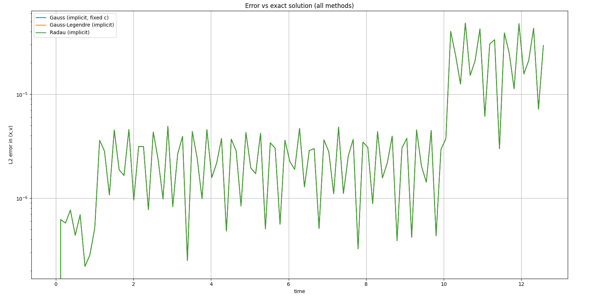

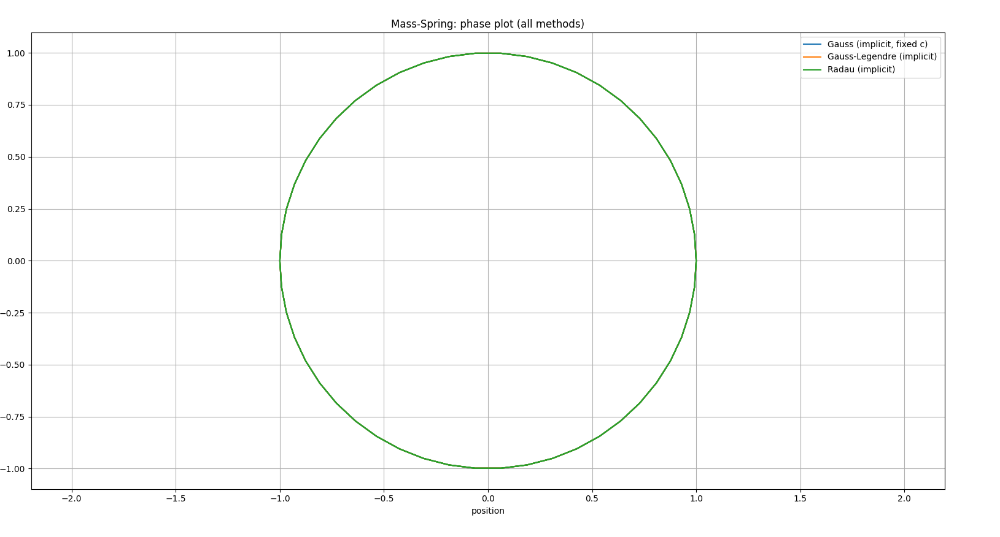


#### Conclusion

The Gauss2, Gauss3, and Radau IIA are all high order with Gauss-Legendre being $2s$ where $s$ is the number of stages, and Radau being $2s-1$. This meant that the global errors were very small compared to the amplitude, which is shown with the graphs overlapping almost perfectly. When zooming in, some differences can be noted but the differences is very small. These differences would be greater if the time steps became larger, or over a much longer time.

### Implementation of Explicit Runge-Kutta Method

The explicit Runge-Kutta Method was implemented in a class `ExplicitRungeKutta` which was able to store a general lower-triangular Butcher matrix `A` and vectors `b` and `c`.

This was then implemented wit the RK2 Method, the RK4 method and the Nyström method.

#### Graphs

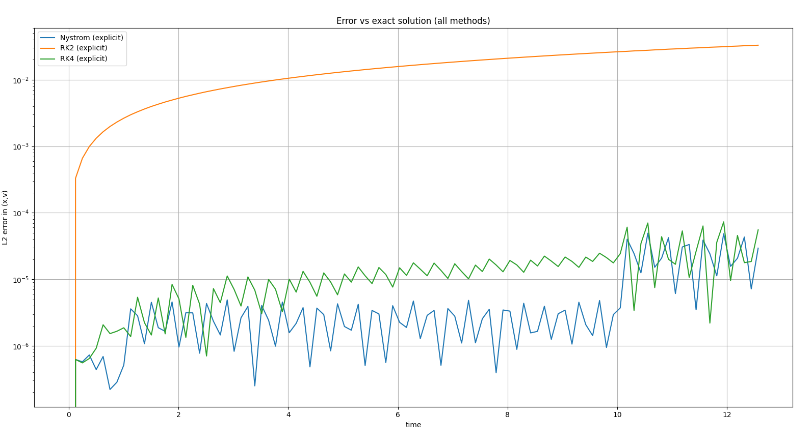


#### Conclusion

The results showed that as the order increased, the Methods became more accurate with a smaller deviation from the Analytic Solution. They also showed that the answers were all more similar at the beginning and that the deviations were larger at the end. The order of accuracy also scaled with what order so the `RK2`  method had the largest error. The Nyström method had an error very similar to the implicit methods, so very low, but it alos is the most expensive per step. They are explicit methods, which means they are conditionally stable and as the step size increases they will eventually lose accuract and stability.


# Exercise 20.4.1 Mass-spring system

We consider a mechanical system composed of point masses connected by springs and possibly fixed supports.

First, we extend the formulation by constraints using Lagrange multipliers. This allows us, for example, to enforce a fixed distance between two masses. For the implementation of the constraints the force evaluation in the simulation code is modified and the equations of motion are expanded by a constraint equation. The time integration scheme (Newmark method) remains unchanged.

Before we dive into the how the library can be used to simulate rigid body mechanics, we will go through the mathematical model, that makes up the foundation of this library.

---

## 1. Original Mathematical Model

### System State

We simulate $N$ point masses in a space of dimension $D$.

The full position vector is

$$
x \in \mathbb{R}^{n}, \qquad n = D \cdot N,
$$

Each mass $i$ has position $x_i \in \mathbb{R}^D$, velocity $\dot{x}_i$, and acceleration $\ddot{x}_i$.

---

### Forces

Each mass is subject to external and internal forces.

##### Gravity:

$$
F_i = m_i\, g.
$$

##### Spring Forces:

For a spring between masses \(i\) and \(j\):

$$
F_{ij}
=
k\bigl(\|x_i - x_j\| - L_0\bigr)\,
\frac{x_j - x_i}{\|x_j - x_i\|}.
$$

This contributes to the global force vector \(F(x)\).

---

### Equations of Motion (Unconstrained)

Without constraints, the dynamics satisfy

$$
M\ddot{x} = F(x),
$$

where  
- $M$ is diagonal matrix with masses on the diagonal,  
- $F(x)$ is the vector of applied forces.

Thus the acceleration is

$$
a(x) = M^{-1} F(x).
$$

This is the behavior implemented in `MSS_Function` when no constraints are added. The acceleration is what is given to the Newmark solver.

---

## 2. Adding Constraints

We now introduce a constraint of the form

$$
g(x) = 0.
$$

These constraints modify the equations of motion.  
We introduce the Lagrangian as:

$$
\mathcal{L}(x,\lambda)
=
-U(x) + \lambda^T g(x).
$$

Differentiating yields a coupled system of two equations:

$$
M\ddot{x}
=
-\frac{\partial U}{\partial x}
+
G(x)^{T}\lambda
\quad\text{(Modified Newton Equation)}
$$

$$
g(x) = 0
\quad\text{(Constraint Equation)}
$$

---

### Example: Distance Constraint

To enforce a distance constraint such that the distance between two masses $A$ and $B$ remains equal to some defined length $L_0$, $g(x)$ is defined as follows:

$$
g(x) = \|x_A - x_B\|^2 - L_0^2.
$$

Then

$$
\frac{\partial g}{\partial x_A} = 2(x_A - x_B),
\qquad
\frac{\partial g}{\partial x_B} = -2(x_A - x_B).
$$

This is implemented in `DistanceConstraint`.

---

## 3. Saddle-Point System for $\ddot{x}$ and $\lambda$

Adding the constraints finally leads to the linear saddle-point system

\[
\begin{pmatrix}
M & G^T \\
G & 0
\end{pmatrix}
\begin{pmatrix}
\ddot{x} \\ \lambda
\end{pmatrix}
=
\begin{pmatrix}
F(x) \\ -g(x)
\end{pmatrix}.
\]

Solving this system provides both:
- the **accelerations** $\ddot{x}$, needed by the Newmark solver,
- the **Lagrange multipliers** $\lambda$, enforcing the constraint.

To avoid modifying the Newmark solver, the linear saddle-point system is solved using a linear solver from the Eigen library. Only the accelerations $\ddot{x}$ are then passed to the Newmark time-integration method, while the multipliers $\lambda$ are used internally to enforce the constraint.

---
### 2. Analytic Derivative of Acceleration

The C++ function `evaluateDeriv` computes the Jacobian to solve a mass-spring system for both constrainted and unconstrained cases:

$$
J = \frac{\partial \ddot{x}}{\partial x}
$$

---

### 2.1 Spring Contribution ($K_\text{spring}$)

For each spring connecting points $p_1, p_2&  with stiffness $k$ and lenght of the string at rest defined as $\ell$, the code defines the current length $d = \|p_2 - p_1\|$ and unit direction $\text{dir} = (p_2 - p_1)/d$.

The local stiffness scalars are defined as:

$$
k_e = k, \qquad k_g = k\left(1 - \frac{\ell}{d}\right).
$$

These are used to compute the local matrix:

$$
K_\text{loc} = k_g I_D + (k_e - k_g)\,\text{dir}\,\text{dir}^\top.
$$

The global matrix $K_\text{spring} \in \mathbb{R}^{n_\text{dof} \times n_\text{dof}}$ is assembled by adding $-K_\text{loc}$ to the diagonal blocks of the connected masses and $+K_\text{loc}$ to the off-diagonal blocks, yielding:

$$
K_\text{spring} = \frac{\partial F_\text{spring}}{\partial x}(x).
$$

---

### 2.2 Unconstrained Case

If there are no constraints ($m = 0$), with $m$ being the number of constraints, the equations of motion are defined as:

$$
M \ddot{x} = F(x) \quad\Rightarrow\quad \ddot{x}(x) = M^{-1} F(x).
$$

Therefore, the Jacobian is computed by row-wise division of $K_\text{spring}$ by the corresponding masses:

$$
J = \frac{\partial \ddot{x}}{\partial x} = M^{-1} K_\text{spring}.
$$

---

### 2.3 Constrained Case

If constraints exist, the function builds the KKT matrix $AE$, where $M$ is the diagonal mass matrix and $G$ is the constraint Jacobian:

$$
AE = \begin{pmatrix} M & G^\top \\ G & 0 \end{pmatrix}.
$$

The system solves for the total Jacobian $J_{\text{total}}$ using a right-hand side composed of $K_\text{spring}$:

$$
\begin{pmatrix} M & G^\top \\ G & 0 \end{pmatrix} \begin{pmatrix} J \\ J_\lambda \end{pmatrix} = \begin{pmatrix} K_\text{spring} \\ 0 \end{pmatrix}.
$$

---

# Examples

In this section, the four different physical systems modeled and simulated using the library are presented

1. A **Double Pendulum**
2. A **Chain Pendulum**
3. A **Crane Structure**
4. A **Spinning Top**

Out of these four systems, **two make use of the newly implemented constraint formulation**:  
the **Double Pendulum** and the **Spinning Top**.  


---

## Double Pendulum

In this example, two masses are connected in a pendulum-like configuration, both a spring-based and a constraint-based formulation are implemented.


```cpp
# for a 2 mass pendulum
mss = MassSpringSystem3d()
mss.gravity = (0,0,-9.81)
mA = mss.add(Mass(1, (1,0,0)))
mB = mss.add(Mass(2, (2,0,0)))
f1 = mss.add(Fix((0,0,0)))
mss.add(Spring(1, 200000, (f1, mA)))
mss.add(Spring(1, 100000, (mA, mB)))
```

<video width="600" controls>
  <source src="mech/double_pendulum.mp4" type="video/mp4">
</video>


This render shows the double pendulum in its spring-based formulation.  


### Double Pendulum with the constraint-based formulation

```cpp
# Create System
mss = MassSpringSystem3d()
mss.gravity = (0, 0, -9.81)

pivot = mss.add(Fix((0, 0, 0)))

m1 = mss.add(Mass(1.0, (1.0, 0.0, 0.0)))
m2 = mss.add(Mass(1.0, (2.0, 0.0, 0.0)))

ndof = 3 * len(mss.masses)

mss.addConstraint(DistanceConstraint3d(ndof, pivot, m1, 1.0, mss))

mss.addConstraint(DistanceConstraint3d(ndof, m1, m2, 1.0, mss))
```

<video width="600" controls>
  <source src="mech/double_pendulum_constrained.mp4" type="video/mp4">
</video>

 The **difference in numerical stability and oscillation behavior between both formulations can be clearly observed in the provided Python notebook**.

---

## Chain Pendulum

This example models a flexible chain consisting of multiple masses connected by springs and fixed at one end.

```cpp
mss = MassSpringSystem3d()
mss.gravity = (0,0,-9.81)

use_constraint = True

number_of_masses = 10
starting_position = (0,0,0)
length_chain = 10
single_length = length_chain/number_of_masses

prev_obj = mss.add(Fix(starting_position))
for i in range(number_of_masses):
     pos = (starting_position[0] + (i + 1) * single_length,
            starting_position[1],
            starting_position[2])
     new_mass = mss.add(Mass(1.0, pos))
     mss.add(Spring(1, 10000, (prev_obj, new_mass)))
     prev_obj = new_mass
```

<video width="600" controls>
  <source src="mech/chain.mp4" type="video/mp4">
</video>


The chain is fixed at its left end and swings freely under the influence of gravity. This system is modeled purely using springs and does not use the new constraint formulation.

---

## Crane

This example simulates a flexible crane structure constructed from a truss-like network of stiff springs and a heavy load at the tip.

```cpp
mss = MassSpringSystem3d()
mss.gravity = (0, 0, -9.81)

num_bays = 5        
width = 1.0           
height = 1.0          
length = 1.0          
stiffness = 50000     

cable_len = 2.0       
load_mass = 50.0      

diag_len = math.sqrt(length**2 + height**2)
cable_diag = math.sqrt((width/2)**2 + cable_len**2)

p_bl = mss.add(Fix((0, 0, 0)))          
p_br = mss.add(Fix((0, width, 0)))      
p_tr = mss.add(Fix((0, width, height))) 
p_tl = mss.add(Fix((0, 0, height)))     

for i in range(num_bays):
    x = (i + 1) * length
    
    c_bl = mss.add(Mass(1.0, (x, 0, 0)))         
    c_br = mss.add(Mass(1.0, (x, width, 0)))      
    c_tr = mss.add(Mass(1.0, (x, width, height))) 
    c_tl = mss.add(Mass(1.0, (x, 0, height)))    

    mss.add(Spring(length, stiffness, (p_bl, c_bl)))
    mss.add(Spring(length, stiffness, (p_br, c_br)))
    mss.add(Spring(length, stiffness, (p_tr, c_tr)))
    mss.add(Spring(length, stiffness, (p_tl, c_tl)))

    mss.add(Spring(width,  stiffness, (c_bl, c_br))) 
    mss.add(Spring(height, stiffness, (c_br, c_tr))) 
    mss.add(Spring(width,  stiffness, (c_tr, c_tl))) 
    mss.add(Spring(height, stiffness, (c_tl, c_bl))) 

    mss.add(Spring(diag_len, stiffness, (p_bl, c_tl))) 
    mss.add(Spring(diag_len, stiffness, (p_br, c_tr))) 
    mss.add(Spring(diag_len, stiffness, (p_tl, c_tr))) 
    mss.add(Spring(diag_len, stiffness, (p_bl, c_br))) 

    p_bl, p_br, p_tr, p_tl = c_bl, c_br, c_tr, c_tl

tip_x = num_bays * length
load_y = width / 2.0
load_z = height - cable_len

load_node = mss.add(Mass(load_mass, (tip_x, load_y, load_z)))

mss.add(Spring(cable_diag, stiffness, (p_tl, load_node)))
mss.add(Spring(cable_diag, stiffness, (p_tr, load_node)))
```

<video width="600" controls>
  <source src="mech/crane.mp4" type="video/mp4">
</video>

The single mass at the lower right represents the load with a mass of 50 units, while all other masses have unit mass. The crane is fixed on the left side and bends under the applied gravitational load.

---

## Spinning Top

This example models a rigid spinning top using three mass nodes and a fixed pivot. Distance constraints are used to enforce rigid body behavior, making this the second system that relies on the newly implemented constraint formulation.

```cpp
mss = MassSpringSystem3d()
mss.gravity = (0, 0, -9.81)

H = 1.0          
R = 1.0          
omega = 10.0     
mass_val = 1.0   
tilt = 0.1      

pivot = mss.add(Fix((0, 0, 0)))

mass_nodes = []
angles = [0, 2*math.pi/3, 4*math.pi/3]

for theta in angles:
    px = R * math.cos(theta) + tilt
    py = R * math.sin(theta)
    pz = H
    m_node = mss.add(Mass(mass_val, (px, py, pz)))
    mass_nodes.append(m_node)
    
    rel_x = px - tilt
    rel_y = py
    mss.masses[m_node.nr].vel = [-omega * rel_y, omega * rel_x, 0.0]

ndof = 3 * len(mss.masses)

for m_node in mass_nodes:
    p_pivot = np.array(mss.fixes[pivot.nr].pos)
    p_mass = np.array(mss.masses[m_node.nr].pos)
    dist = np.linalg.norm(p_mass - p_pivot)
    mss.addConstraint(DistanceConstraint3d(ndof, pivot, m_node, dist, mss))

for i in range(len(mass_nodes)):
    nA = mass_nodes[i]
    nB = mass_nodes[(i + 1) % 3]
    pA = np.array(mss.masses[nA.nr].pos)
    pB = np.array(mss.masses[nB.nr].pos)
    dist = np.linalg.norm(pA - pB)
    mss.addConstraint(DistanceConstraint3d(ndof, nA, nB, dist, mss))
```

<video width="600" controls>
  <source src="mech/spinning_top.mp4" type="video/mp4">
</video>

The three rotating masses form a rigid triangular structure connected to the pivot by distance constraints. The initial angular velocity defines the spin of the top, and the constraints ensure that the geometric structure remains rigid throughout the simulation.

---
